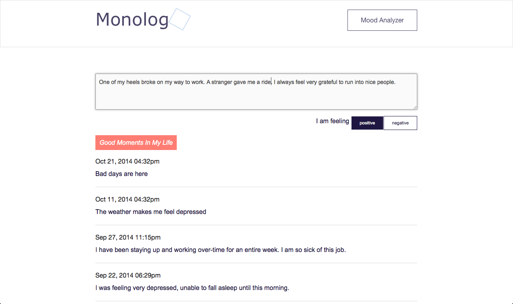
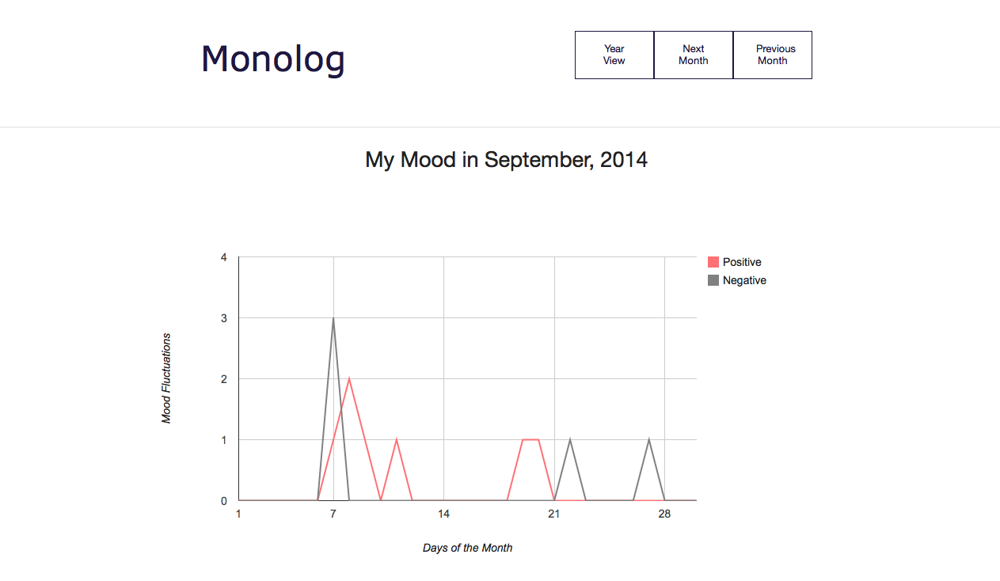
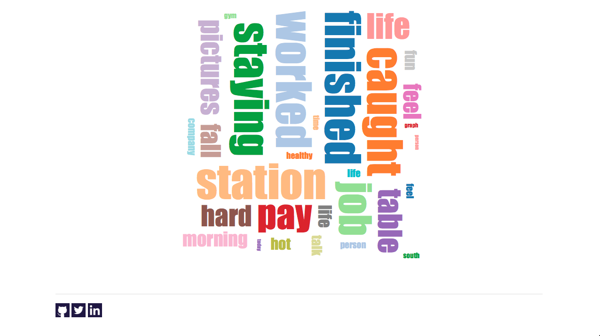

Monolog

Monolog is a Ruby on Sinatra Web App designed to promote self-introspection and boost positive emotions through writing and mood analyzing. Monolog is the place where users can record feelings, easily spot phases with emotional turbulances, and look back at good moments in life. Monolog provides a private twitter-like interface for users to post private status and make two-alternative forced choice choice of emotions. Users can keep track of their emotional fluctuations through the chart and the word cloud.

